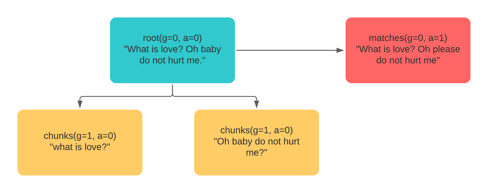

# Understand Jina Recursive Document Representation

In Jina, each `Document` is represented as a recursive representation (tree).

A rooted recursive representation has a root node and every node has X childrens.
In Jina, the root node is the document itself, while the *left* & *right* children are referred as *chunks* and *matches* respectivaly.


The above image illustrates a minimal document structure: A document (root node) consist of two child nodes: *chunks* and *matches*.
`chunks`s are a sequence of `Document`s which is attached to the root document with a higher `granularity` degree. `Matches` is a sequence of `Document`s  which are semantically related to the root document.
We'll dive into these concepts in this document:

- [Chunks](#chunks)
- [Matches](#matches)
- [Let's go deeper: Recursive Document Representation](#recursive-document-representation)
- [Document Traversal with traversal paths](#document-traversal-with-traversal-paths)


## Chunks

Each Jina `Document` consist a list of `Chunk`s. A `Chunk` is a small semantic unit of a `Document`, like a sentence or a 64x64 pixel image patch.
Most of the algorithms in Jina works on the `Chunk` level.

Think about these use cases: you wanna search a document at a specific `granularity` level, e.g. a sentence or a paragraph. Or your query consist of mutiple modalities, such as your query consist of a piece of text together and an image. `Chunk` makes it feasible!

In Jina [primitive data types](https://hanxiao.io/2020/11/22/Primitive-Data-Types-in-Neural-Search-System/), `Chunk` is defined as a `property` of `Document`:

```python
from jina import Document

with Document() as root:
    root.text = 'What is love? Oh baby do not hurt me.'
# Initialised a document as root with 0 chunks.
print(len(root.chunks))
>>> 0
# Initialise two documents and add as chunks to root.
with Document() as chunk1:
    chunk1.text = 'What is love?'
    root.chunks.add(chunk1)
with Document() as chunk2:
    chunk1.text = 'Oh baby do not hurt me.'
    root.chunks.add(chunk2)
# Now the document has 2 chunks
print(len(root.chunks))
>>> 2
```

What happened by adding `chunk` to `root`?

```python
print(root.granularity)
>>> 0
print(root.chunks[0].granularity)
>>> 1
root.id == root.chunks[0].parent_id
>>> True
```

This can be seen in the image blow:


The above code sample & graph demonstrates the basic idea of a `Chunk` in a `Document`.
At the beginning, we initialised a `Document` with `granularity=0` (by default).
We then initialised two chunks and add them to the `root` document.
Two things happened when adding the `chunk` to `root`:

1. The granularity of the chunk has been increased by 1 (default 0).
2. The `chunk` has been referenced to it's parent: `root`.

This allows Jina (and you) to query chunks and reference back to it's root document at any `granularity` level.

## Matches

In a neural search system (and traditional retrieval system), matches are the expected documents returned from the system given the user query.
In Jina, `Matches` could happens at `root` level or any `chunk` level.

In order to fully understand the concept of `Matches`, we introduce a new term, named `adjacency` (short for `a` in the diagram), reflects the level of the document it is connected to.

**NOTE: adjacency applys to both chunks and matches.**

```python
from jina import Document

with Document() as root:
    root.text = 'What is love? Oh baby do not hurt me.'
print(root.adjacency)
>>> 0
with Document() as match:
    # a match document semantically related to our root
    match.text = 'What is love? Oh please do not hurt me.'
    root.matches.add(match)
print(len(root.matches))
>>> 1
print(root.matches[0].granularity)
>>> 0
print(root.matches[0].adjacency)
>>> 1

```




By default, the `root` node has an `adjacency` of 0, and the value increase by 1 when the `matches` go deeper.


